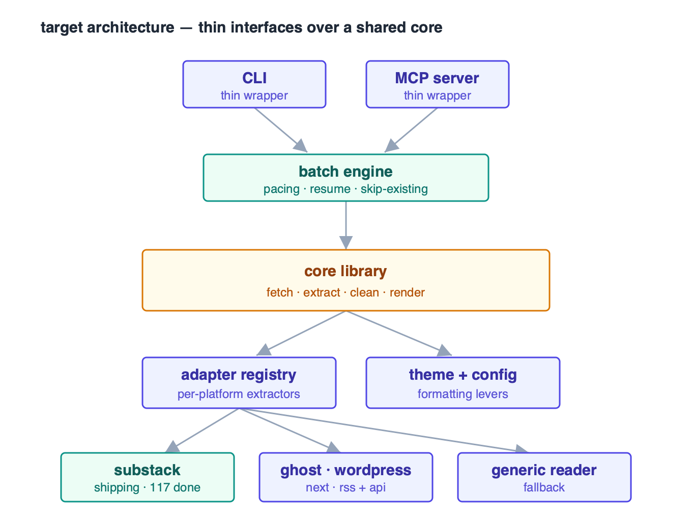

# substack2pdf

Convert Substack articles into clean, nicely formatted PDFs.

It pulls the article title, subtitle, and byline, the full body, inline images
(downloaded and embedded at high resolution), captions, pull quotes, code
blocks, and footnotes (rendered as a linked **Notes** section with backlinks) —
and lays it all out as a readable, print-friendly PDF using a serif book style.

Works for free/public posts directly from a URL, and for paywalled posts you
subscribe to via either browser cookies or a saved HTML page.

<sub>Status last verified 2026-08-18 · Substack support shipping (validated
against 120+ live articles) · on kit 2.5.0 · see [ROADMAP.md](ROADMAP.md).</sub>

---

## Installation

Requires **Python 3.10+**.

```bash
pip install requests beautifulsoup4 lxml weasyprint
```

WeasyPrint relies on native libraries (Pango, GLib, Cairo, etc.). On most
platforms `pip` handles everything, but if you used the python.org build on
macOS you'll also need the Homebrew libraries:

```bash
brew install pango glib cairo gdk-pixbuf libffi
```

> **macOS note:** the python.org framework build of Python doesn't search
> Homebrew's library path by default, which makes WeasyPrint fail to import.
> This script detects that case and points it at `/opt/homebrew/lib` (or
> `/usr/local/lib` on Intel) automatically — no env vars needed.

See WeasyPrint's [installation guide](https://doc.courtbouillon.org/weasyprint/stable/first_steps.html)
if you hit native-library issues on Linux or Windows.

---

## Usage

### Free / public posts

```bash
python substack2pdf.py https://example.substack.com/p/some-post
```

The PDF is written to `output/<title-slug>.pdf` by default.

### Custom output path

```bash
python substack2pdf.py https://example.substack.com/p/some-post -o ~/Desktop/article.pdf
```

### Paywalled posts you subscribe to

You have two options.

**Option A — browser cookies.** Export your cookies in Netscape format using a
browser extension such as *Get cookies.txt*, then:

```bash
python substack2pdf.py https://example.substack.com/p/paid-post --cookies cookies.txt
```

**Option B — saved HTML.** Open the post in your logged-in browser, save the
page (`Cmd/Ctrl+S` → "Webpage, Complete" or single HTML), then point the tool at
the saved file:

```bash
python substack2pdf.py saved_page.html
```

> ⚠️ **Your `cookies.txt` is a credential — it grants access to your logged-in
> accounts.** Never commit it, share it, or upload it anywhere. This repo's
> `.gitignore` excludes it for that reason.

---

## How it works

1. **Fetch** — loads the post from a URL (with optional cookies) or a local HTML
   file.
2. **Extract** — pulls metadata from Open Graph tags and JSON-LD, and locates
   the article body.
3. **Clean** — strips subscribe widgets, share buttons, embeds, and other site
   chrome.
4. **Embed images** — downloads each image at the best available resolution and
   inlines it so the PDF is self-contained.
5. **Footnotes** — collects footnotes into a linked Notes section with backlinks.
6. **Render** — styles everything with a serif book layout and writes the PDF
   via WeasyPrint.

---

## Options

| Argument | Description |
| --- | --- |
| `source` | Article URL, or path to an HTML file saved from your browser. |
| `-o`, `--output` | Output PDF path (default: `output/<title-slug>.pdf`). |
| `--cookies` | Path to a Netscape-format `cookies.txt`, for paywalled posts. |
| `--source-url` / `--no-source-url` | Append the article's source URL to the end of the PDF (default: enabled). |

---

## Notes & limitations

- Paywalled content is only as accessible as your cookies/saved page allow — the
  tool does not bypass paywalls, it just uses your own logged-in session.
- Audio/video embeds are stripped (PDFs are static); their captions may remain.
- Layout is tuned for typical Substack posts; unusual custom HTML may need CSS
  tweaks in the `CSS` string near the top of `substack2pdf.py`.

---

## Where this is headed

Today this is a single script. The plan is to grow it into a small **core
library** (`fetch → extract → clean → render`) with thin interfaces wrapped
around it — so the same engine powers the CLI, a batch runner, an MCP server,
and a GUI, and so new publications are added as pluggable *adapters* rather than
one-off scripts.



### Roadmap

The table below is the public summary; **[ROADMAP.md](ROADMAP.md) is the
canonical, phase-gated source of truth** (with acceptance criteria and the
Prior-Art bookends). The phases are independently shippable, and each is built
test-first against saved HTML fixtures (free, paywalled, footnote-heavy,
image-heavy) so new adapters can be added gradually without regressing the ones
that already work.

| Phase | Focus | Notes |
| --- | --- | --- |
| 0 | **Package + core split** | `pyproject.toml`, `pipx` entry point, split into modules, fixture-based test harness. |
| 1 | **Built-in batch** | Multiple URLs / a publication root / a URL file; archive enumeration; pacing, backoff, `--skip-existing`, and a resume manifest. |
| 2 | **Formatting levers** | CSS factored into a theme (page size, margins, fonts, dividers, footnotes) driven by config file + CLI flags. |
| 3 | **Adapter abstraction** | Domain → adapter registry; Substack as the first formal adapter. |
| 4 | **MCP server** | Core exposed as MCP tools (`convert_url`, `list_publication`, `convert_batch`) with a job model for long-running batches. |
| 5 | **More platforms** | Ghost / WordPress adapters (RSS + content API) and a generic readability fallback for arbitrary blogs. |
| 6 | **Simple GUI** | Local web app: paste URL(s) or pick a publication, toggle common formatting options, watch progress, download PDFs. |
| 7 | **Formatting studio** | Advanced GUI with live preview, a full theme editor, and saved/shareable formatting presets. |

Live phase state, acceptance criteria, and the current debt list live in
[ROADMAP.md](ROADMAP.md) — this table is a summary and defers to it.

## License

MIT
